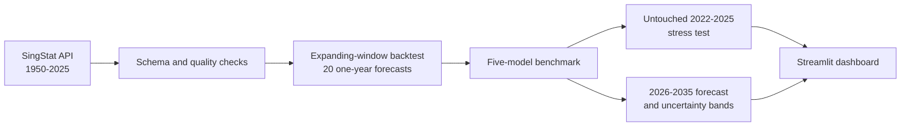

# Singapore Population Forecasting & Scenario Analysis

[](https://singapore-population-forecasting-cas0801.streamlit.app/)
[](https://www.python.org/)
[](#reproduce-the-project)
[](data/SOURCES.md)

An end-to-end forecasting system built from **76 years of official Singapore population data**. It benchmarks five statistical and machine-learning models with leakage-safe temporal validation, produces 2026-2035 forecasts with uncertainty bands, and exposes the results through an interactive dashboard.

**[Launch the live dashboard](https://singapore-population-forecasting-cas0801.streamlit.app/)** · **[Read the full project report](PROJECT_REPORT.md)** · **[Review the data provenance](data/SOURCES.md)**

## At a glance

| Data | Validation | Best backtest model | Backtest RMSE | 2035 forecast |
| --- | --- | --- | ---: | ---: |
| SingStat, 1950-2025 | 20 rolling-origin folds | SARIMAX | 80,974 people | 7.29M |

### Why this project matters

A simple random split is misleading for forecasting because it can train on the future and test on the past. This project simulates real deployment: every prediction uses only information available before its target year. It also keeps 2022-2025 untouched as a final stress test.

The most important finding is not a headline forecast. SARIMAX wins the 2002-2021 rolling backtest, but performs poorly through the post-COVID rebound. That reversal demonstrates why forecast horizon, structural breaks, and model monitoring matter.

## System workflow



## Models and results

The benchmark includes naive drift, linear regression, polynomial ridge, random forest, and SARIMAX.

| Model | Backtest RMSE (2002-2021) | Final holdout RMSE (2022-2025) |
| --- | ---: | ---: |
| **SARIMAX** | **80,974** | 1,025,400 |
| Naive drift | 97,438 | 336,534 |
| Random forest | 248,936 | 376,237 |
| Polynomial ridge | 360,299 | **93,558** |
| Linear regression | 453,240 | 264,471 |

SARIMAX improves rolling RMSE by **16.9%** over naive drift. However, its weak final holdout shows that a model optimized for repeated one-year forecasts can fail across a multi-year structural shock. Polynomial ridge's holdout win is reported, but it is not selected after viewing the final test period because that would introduce selection bias.

The selected SARIMAX model estimates **6.67 million people in 2030** and **7.29 million in 2035**. The approximate 2035 sensitivity interval is **6.78-7.79 million**. These are model-based planning scenarios—not official demographic projections.

## Evaluation design

```text
Train through 2001 → predict 2002
Train through 2002 → predict 2003
...
Train through 2020 → predict 2021
Select model using these 20 folds
Evaluate once on untouched 2022-2025 holdout
Refit on all data → forecast 2026-2035
```

RMSE is the primary selection metric, with MAE and MAPE reported for interpretability. Full fold-level predictions are available in [`reports/backtest_predictions.csv`](reports/backtest_predictions.csv).

## Data and reproducibility

The primary target is SingStat's `Total Population` series (`M810001`), which includes residents and non-residents. The source contains definition changes around 1990 and 2003; these are documented rather than silently ignored. See [`data/SOURCES.md`](data/SOURCES.md) for provenance and limitations.

```bash
git clone https://github.com/Cas0801/singapore-population-forecasting.git
cd singapore-population-forecasting
python -m venv .venv
source .venv/bin/activate
pip install -r requirements.txt
python -m src.train --input data/raw/singapore_total_population.csv
streamlit run app.py
```

Regenerate the official dataset with:

```bash
python -m src.download_singstat
```

Run the validation suite:

```bash
pytest -q
```

## Repository structure

```text
├── app.py                    # Interactive Streamlit product
├── src/
│   ├── data.py               # Schema and quality validation
│   ├── download_singstat.py  # Reproducible official-data ingestion
│   ├── models.py             # Forecasting models and baselines
│   └── train.py              # Backtesting, selection, and forecasting
├── data/                     # Source-traceable input and documentation
├── reports/                  # Metrics, fold predictions, and forecast output
├── tests/                    # Automated data/model checks
└── PROJECT_REPORT.md         # Findings, limitations, and next iteration
```

## Technology

Python · pandas · NumPy · scikit-learn · statsmodels · Plotly · Streamlit · pytest

## Limitations and next steps

- Only 76 annual observations are available; deep learning would be poorly justified.
- Total population is strongly affected by migration policy and non-resident flows.
- The current selection objective is one-year accuracy, while the published horizon is ten years.
- Prediction bands are empirical sensitivity bands, not calibrated official confidence intervals.
- A future version should evaluate direct 1-, 3-, 5-, and 10-year horizons and add births, deaths, and migration assumptions.

## Resume-ready summary

> Built a reproducible Singapore population-forecasting pipeline from 76 years of official SingStat data; benchmarked five regression and time-series approaches across 20 rolling-origin folds, improving RMSE by 16.9% over a naive baseline, and delivered 10-year scenario forecasts through a deployed Streamlit dashboard.

The post-COVID holdout degradation is deliberately reported. It is evidence of model-risk analysis, not a result to hide.
